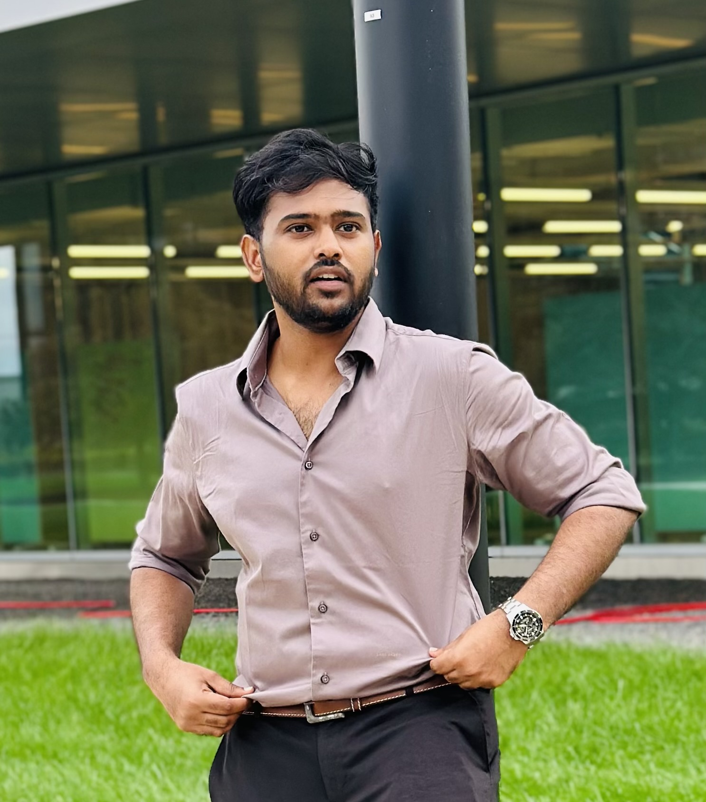

# Rajcaharan Haridasu

## Where are you from?

I was born and brought up in Andhra Pradesh, Inida. Now I am living at 2951 S King Drive, Chicago.

## What was your first computing device?

My first computuing device was a [PlayStation Portable](https://en.wikipedia.org/wiki/PlayStation_Portable "Wikipedia articleb for PSP") (2012).

## IT Interests

I am deeply interested in data analytics, data engineering, and cloud computing. I enjoy exploring how these technologies can be integrated to solve real-world problems and drive innovation.

## Something Interesting About You

I enjoy traveling to new places, which helps me gain diverse perspectives and experiences. I also stay active with regular workouts and love experimenting with cooking, trying out new recipes and flavors.