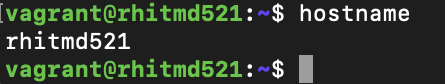
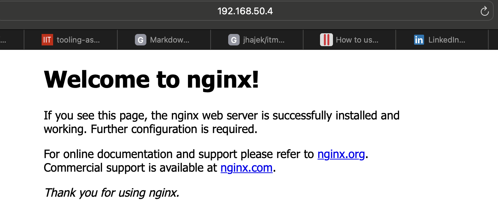
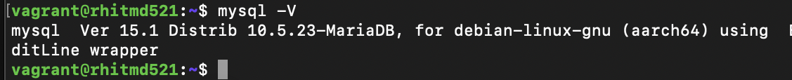
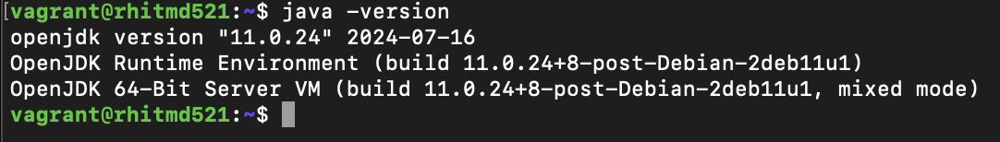
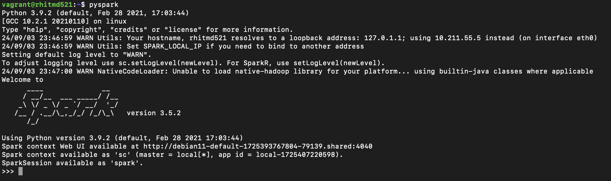
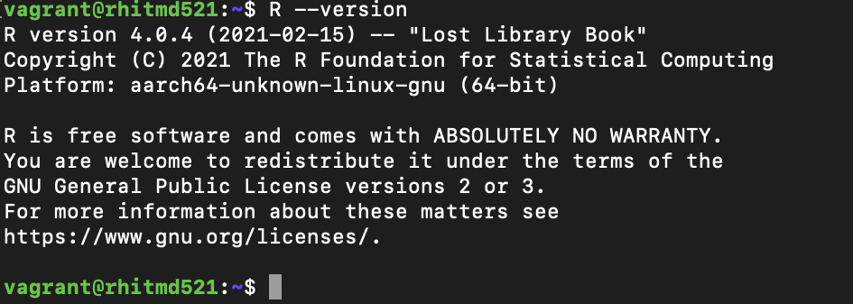
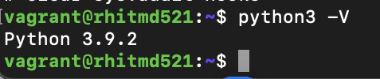
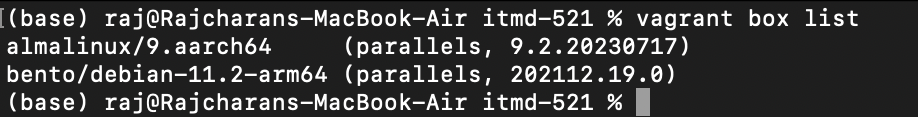

# Tooling Assignment Advanced 

Provide the required screenshots to show that tooling has been properly installed inside of your Ubuntu
Jammy 22.04 Vagrant Box

## Hostname Change

## WebServer Install

## MariaDB Version

## Java Version

## Spark Versions

## R Version

## Python Version

## Result of Cloning Your Private Repository
No need to show the clone action -- just the results of the ls command
Image goes here

## Output of vagrant box list command

## Deliverable
In the document, tooling-assignment-advanced-template.md, provide the required screenshots. Push a
copy of this Markdown file in the private GitHub repo provided, under the itmd-521 folder and make an
additional sub-folder named: tooling-assignments-advanced. Submit the URL to your deliverable to
Blackboard
