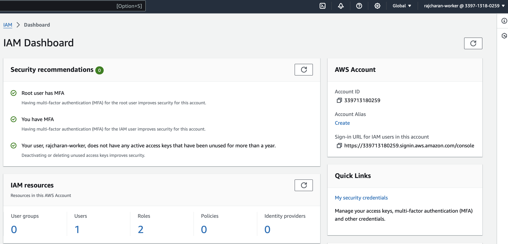
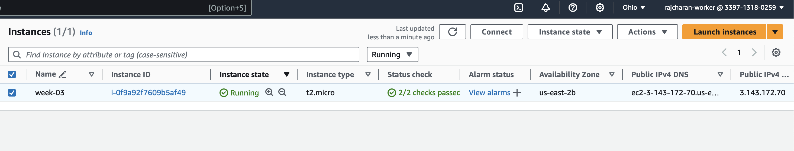
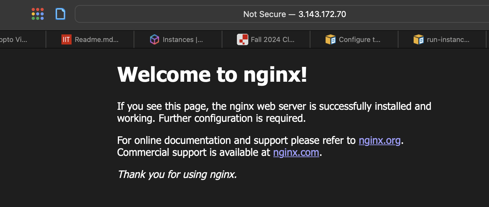
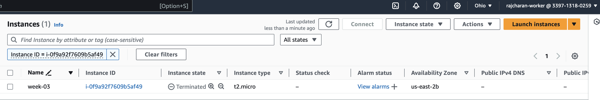

# Module-03 Lab Assignment

## Objectives

* Discuss and explore creating and managing public cloud service accounts securely
* Become familiar with Industry Standard Cloud Computing Console
* Describe and explore the process to launch public cloud infrastructure resources

## Outcomes

At the conclusion of this lab, the user will have explored and experienced creating
and managing public cloud service accounts. They will have had the exposure of
securing those accounts and of having launched basic public cloud infrastructure.

### Part 1

* Sign up for a full account at [aws.amazon.com](https://aws.amazon.com/ "AWS
signup")
* Warning - this requires a credit card and you to manage this
* Configure two factor authentication
* Create a non-root user account
* Take screenshot of the user account ID information after logged in and add it to
this document

### Part 2

Using the AWS Web Console:
* Launch an ubuntu ec2 instance
* type of t2.micro
* SSH into the instance and using the apt package manager install `nginx`
* Take a screenshot including the AWS URL and add to this document
* Go back to the console and **terminate** the EC2 instance
* Take a screenshot showing the EC2 instance is in the **terminated** state

#### Part 2 ScreenShot One

#### Part 2 ScreenShot Two

#### Part 2 ScreenShot Three

### Deliverable

Create a folder named: `module-03` under the itmo-444 (or 544) folder in the
private repo provided to you. Use this markdown template and provide the required
screenshots below the items. Submit just the URL to the markdown document.
