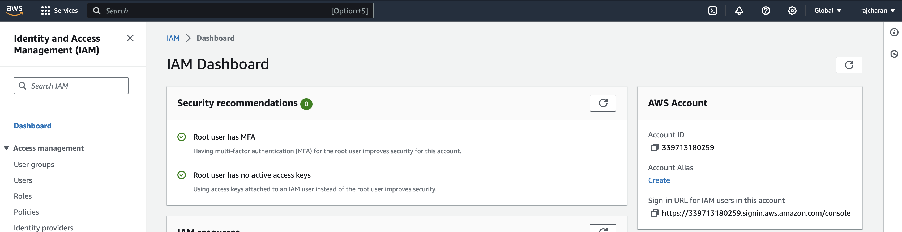
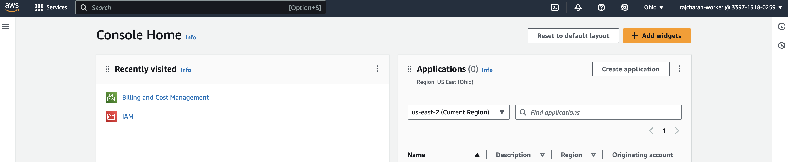
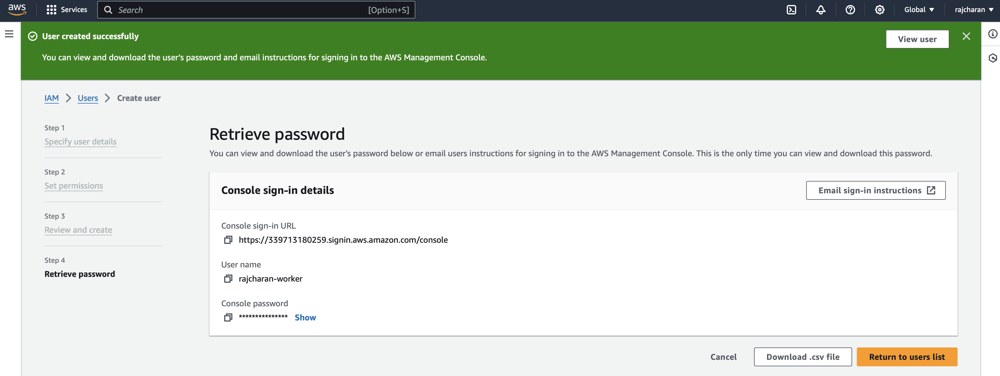
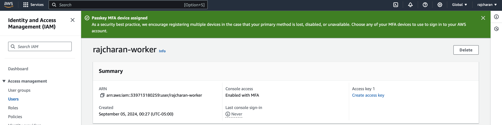
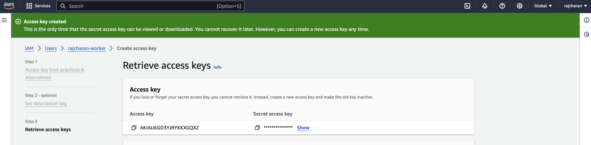

# AWS Setup Assignment

In this assignment you will create your own AWS account using the `Sign Up` link on
the `https://aws.amazon.com` website. You will be installing a virtual machine
environment for development as well.

## Objectives

* Create, manage, and secure your own AWS account
* Create, manage, and deploy your own virtual development environment
* Deploy the concepts of cloud native

### Assignment Elements

Complete the tasks listed below and add the required screenshots to prove that you
have successfully completed each component. These elements assume that you have
successfully created and AWS account.

#### Enable 2FA

#### Non-root Account

#### Create Non-root User

#### Non-root 2FA

#### Non-root User Create Access Keys

### Deliverable

Create a folder named: `aws-assignment` under the directory you made for this class
in your **local** repo. Add the `readme.md` template from Canvas to that directory
on your local system and add the required screenshots. Push to your private GitHub
repo and submit the URL to the Document to Canvas.
