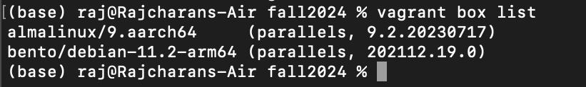

# Tooling Assignment Vagrant

Provide the required screenshots to show that tooling has been properly installed

## WebServer Install

## Output of vagrant box list command

## Deliverable

In your private repo, under the your itmo-444 or itmo-544 folder and make an additional sub-folder
named week-02 > tooling-assignment-vagrant. Submit the URL to your document in the GitHub repo to
Blackboard.
